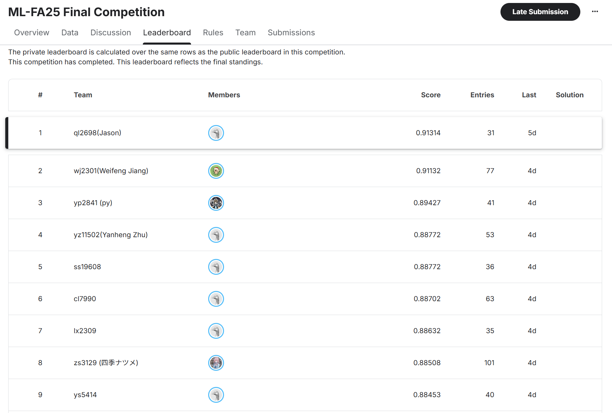

# Echoes of the City: Urban Sound Classification (1st Place Solution)

> **CSCI-SHU 360: Machine Learning (Fall 2025)**
> **Result:** 🥇 **1st Place** (91.3% Accuracy on Private Leaderboard) 🥳🎉🎉🎉



## 🔗 Model Weights
**Download the trained model weights here:**
[Google Drive Link](https://drive.google.com/file/d/18OUNVJTVeQfkAwVMrK4f4tACYxl7iZD1/view?usp=drive_link)

## 📋 Overview & Crucial Data Protocols

This project is the winning solution for the "Echoes of the City" competition. The goal was to classify 10 categories of urban sounds from the **UrbanSound8K** dataset (e.g., engine_idling, gun_shot, siren) under strict constraints.

### ⚠️ Strict Training Standards
I emphasize that all results in this repository are based on rigorous evaluation standards:
* **No Pre-training:** All models are trained entirely **from scratch**.
* **Official Splits:** I strictly utilized the **Official UrbanSound8K Data Folds**.
* **No Reshuffling:** I did **NOT** reshuffle the data. Reshuffling eliminates the "in-the-wild" nature of the dataset and causes data leakage.

## 💡 Method & Performance Analysis

My pipeline leverages **Trainable PCEN**, **FiLM Metadata Fusion**, and **Sharpness-Aware Minimization (SAM)**.

### Model Performance Comparison
* **ResNet-34:** Achieved the **best performance** among the ResNet family and served as my primary baseline.
* **DenseNet121, Res2Net-50, WideResNet-50:** These architectures also performed well and contributed significantly to the final ensemble.
* **ConvNeXt (Failed):** I experimented with ConvNeXt, but it performed poorly. I attribute this to the small dataset size; ConvNeXt lacks the strong **inductive bias** of standard CNNs, making it difficult to generalize without pre-training on this specific task.

### 🚩 Critical Note on Reproducibility (Failed Papers)
I attempted to reproduce the architectures and methods from the following papers. However, my results (using strict official folds without pre-training) were **far lower** than the values claimed in these articles. I **seriously suspect data leakage** (likely due to random shuffling of the dataset) in their experiments:
1.  *FACE: Fast, Accurate and Context-Aware Audio Annotation and Classification*
2.  *Environment Sound Classification Using a Two-Stream CNN Based on Decision-Level Fusion*
3.  *End-to-End Environmental Sound Classification using a 1D Convolutional Neural Network*

## 🚀 Installation

Ensure you have Python 3.x installed.

```bash
pip install -r requirements.txt
```

💡 **For more detailed information and in-depth analysis, please read the [ML_Competition_Report.pdf](ML_Competition_Report.pdf) in the `main` branch.**
